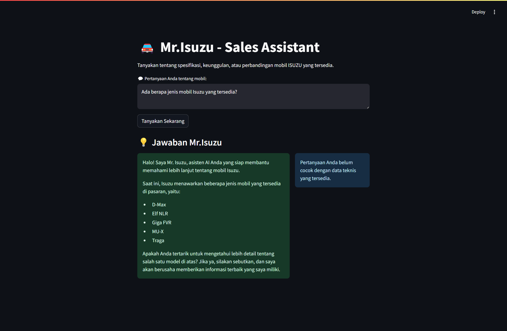
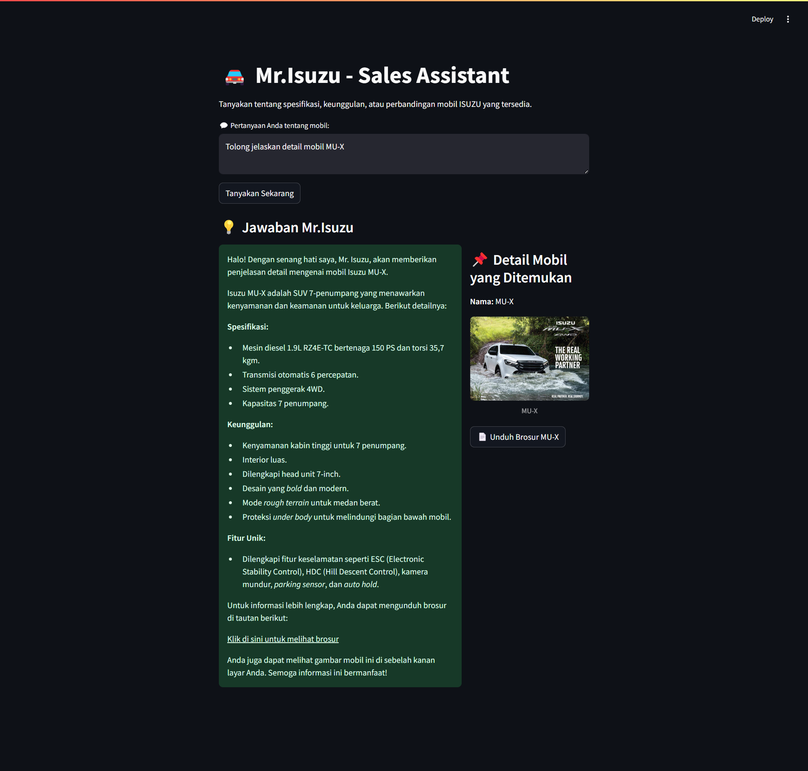
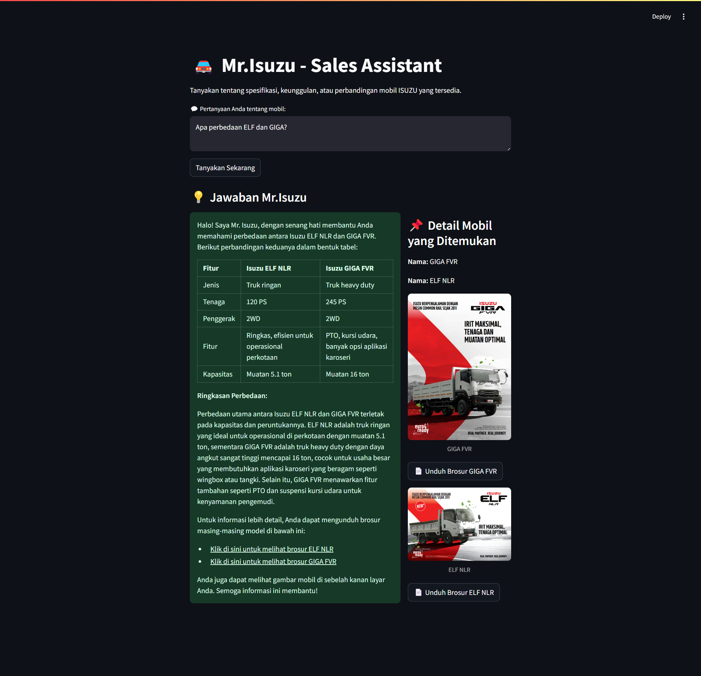
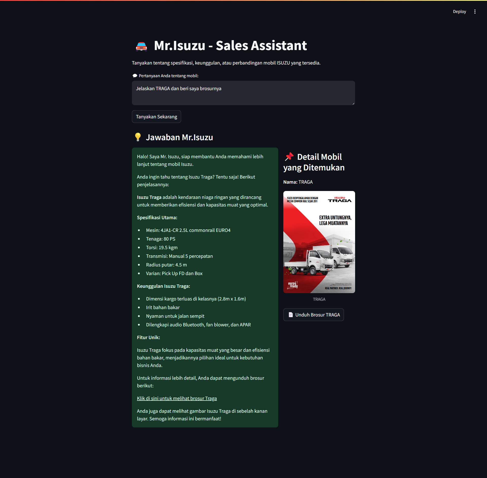
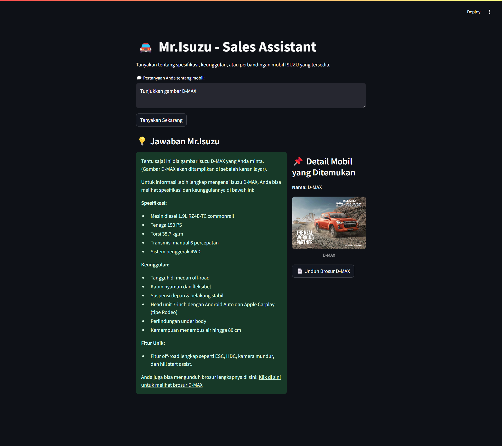
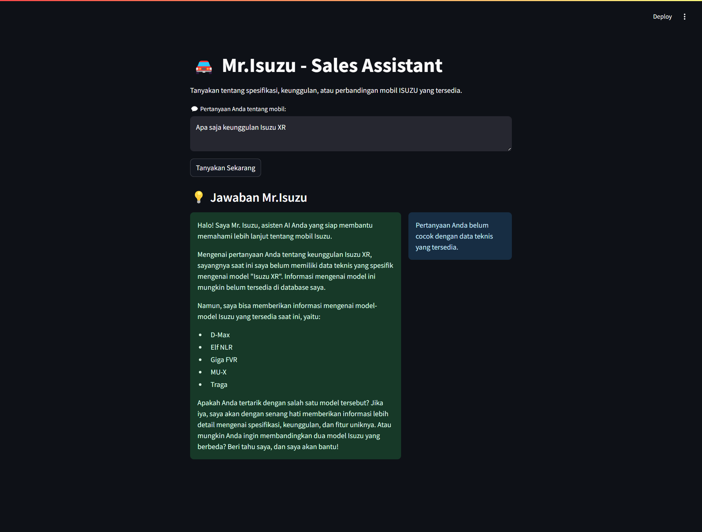
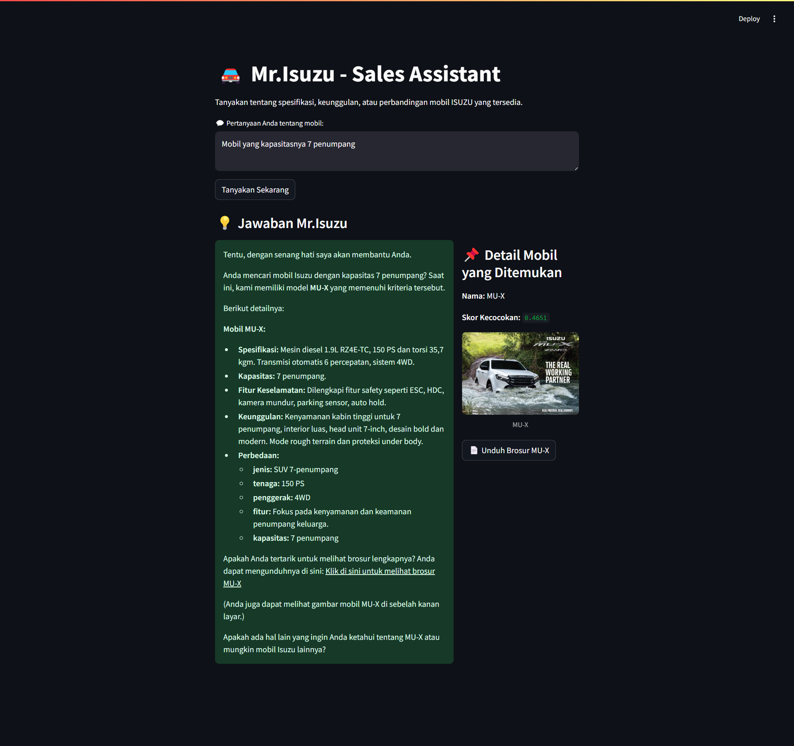

# ✅ Test Cases - Mr.Isuzu AI Assistant

Berikut adalah pengujian fitur-fitur utama dari aplikasi asisten AI mobil Isuzu.

---

## 1. Menampilkan Jumlah Produk
**Pertanyaan:** "Ada berapa jenis mobil Isuzu yang tersedia?"  
**Diharapkan:** AI menyebutkan semua nama mobil yang tersedia.  

**Status:** ✅ Lulus  
**Screenshot:** 

---

## 2. Menampilkan Detail Spesifikasi Mobil
**Pertanyaan:** "Tolong jelaskan detail mobil MU-X"  
**Diharapkan:** AI menampilkan spesifikasi, keunggulan, dan info tambahan tentang MU-X.  

**Status:** ✅ Lulus  
**Screenshot:** 

---

## 3. Perbandingan Dua Produk
**Pertanyaan:** "Apa perbedaan ELF dan GIGA?"  
**Diharapkan:** AI menampilkan tabel perbedaan dan memberikan ringkasan.  

**Status:** ✅ Lulus  
**Screenshot:** 

---

## 4. Menyediakan Sumber (Brosur)
**Pertanyaan:** "Jelaskan TRAGA dan beri saya brosurnya"  
**Diharapkan:** AI menyebutkan bahwa brosur tersedia dan memberikan link/download.  

**Status:** ✅ Lulus  
**Screenshot:** 

---

## 5. Menampilkan Gambar Mobil
**Pertanyaan:** "Tunjukkan gambar D-MAX"  
**Diharapkan:** Gambar mobil muncul di sisi kanan UI.

**Status:** ✅ Lulus  
**Screenshot:** 

---

## 6. Pertanyaan Umum atau Nama Mobil Tidak Sesuai
**Pertanyaan:** "Apa saja keunggulan Isuzu X?" (mobil tidak ada)  
**Diharapkan:** AI memberi tahu bahwa data belum tersedia dan menyarankan nama yang benar.

**Status:** ✅ Lulus  
**Screenshot:** 

---

## 7. Fitur tambahan (Penggunaan Hugging Face + FAISS)
**Pertanyaan:** "Mobil yang kapasitasnya 7 penumpang"

**Diharapkan:** FAISS dapat mencari data yang paling sesuai berdasarkan embedding, dan AI memberikan jawaban meskipun jenis mobil tidak diminta secara langsung.

**Status:** ✅ Lulus  
**Screenshot:** 

---

**Catatan:**  
Semua fitur diuji dalam antarmuka Streamlit dan AI tetap memberikan respon yang relevan, sopan, dan informatif.
